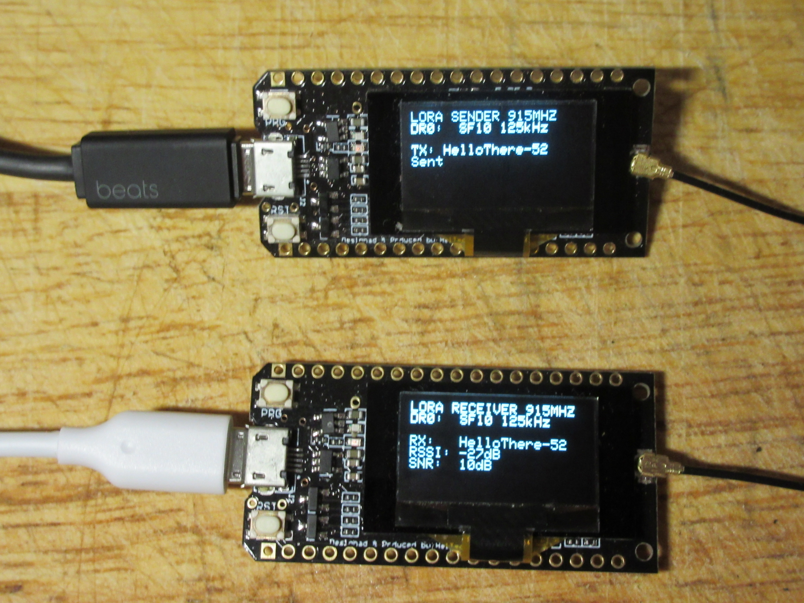
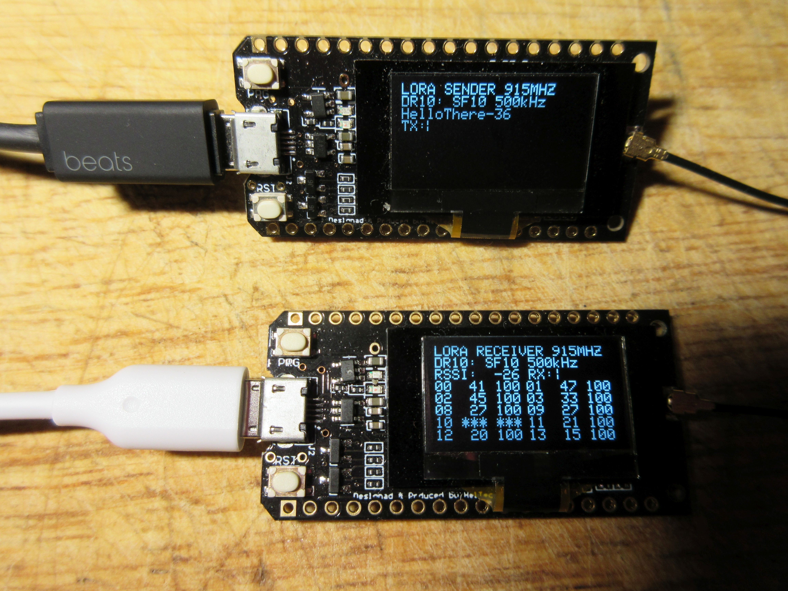

# Introduction

This firmware is used for testing RF transmit and receive capabilities. Right now only LoRa is supported, but other RF protocols may be supported in the future. Unlike most other RF test firmware found elsewhere, there is not separate RX and TX firmware. There is only one firmware, and the RX/TX mode is configurable at run-time by pressing buttons on the board.

# Build Enviromnent

This project uses the PlatformIO environment.

# Supported Boards

The following boards are supported:
* TTGO LORA32 version 1
* TTGO LORA32 verson 2
* TTGO T-Beam

Just change the PlatformIO default build configuration to match the board you are using.

# Changing Modes

For all builds, you initiate a mode change by pressing the RST button. After pressing it, you have two seconds to change the mode, which is slightly different for each of the boards. So, after pressing the RST button, do this:
* TTGO LORA32 V1 - Press the PGM button
* TTGO LORA32 V2 - Press the RST button (because there is no other button)
* TTGO T-Beam - Press the IO38 button

# RX vs TX mode

Repeatedly pressing the mode change button will first cycle through all the RX modes, then all the TX modes, then back to the RX modes again.

# Single Config vs Multi Config Mode

In single config mode, the RF parameters (such as LoRa spread factor, bandwidth, etc) remain constant for both the sender and receiver. The sender sends a message every 10 seconds. When the receiver receives a message, it displays the message, along with the RSSI and SNR values.

In multi config mode, the sender steps through all the configurations in the table and sends a few messages using each configuration. The receiver simultaneously steps through all the configurations and receives those messages. It displays a table of all configurations with signal quality information about each one.

# Single Config Display

The top line of the display will tell you if it's set to TX or RX mode, and will display the frequency band used. The second line will tell you what configuration you have selected. 

On the transmitter, it will display a message every time it transmits a packet, which is once every ten seconds. The packet is the string "HelloThere" plus an incrementing number.

The receiver will display a message every time a packet is received. It will display the packet's contents, along with the RSSI and SNR values.

# Multi Config Display

The top line of the display will tell you if it's set to TX or RX mode, and will display the frequency band used.

Both the sender and receiver need to be in sync. To do this, first power up the receiver. After a couple of seconds, it will display "Syncing". Power up the transmitter. The synchronization should happen on the first message transmitted. Note: Once the receiver has synchronized, there is no attempt to stay in sync. So, if for some reason the clocks drift, synchronization will be lost.

The transmitter will step through each of the configurations and send five packets with each config. The second line of the display will show you which config is being used. Each packet is the string "HelloThere" plus an incrementing number.

The receiver will also step through each of the configs and receive packets. It will also record the RSSI and SNR values, and will display a table of each config with two numbers: The first is the SNR value (in dB), and the second is a percentage of good characters received (0% - 100%).

After the last conifig, it will display the average RSSI and SNR values.
